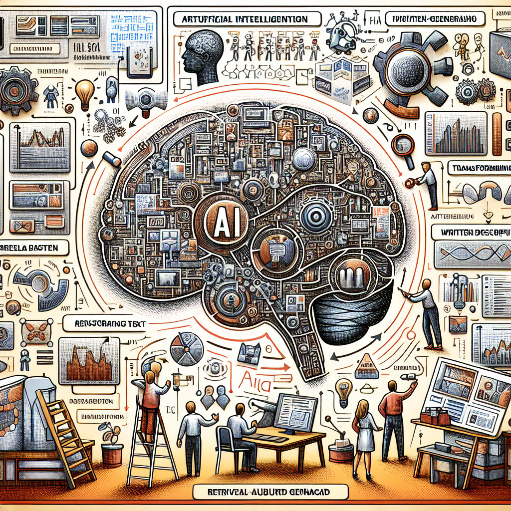

# **Semantic Kernel Cookbook**

***Note:*** The content of this book is based on Semantic Kernel dotnet-1.16.2 and python-1.3.0 and java-1.2.0

With the rise of LLM, AI has entered the 2.0 era. Compared with previous AI technologies, the threshold has been lowered and the applicability has been enhanced. It is no longer limited to the field of data science, and more different types of jobs and roles of people are participating in large-scale research in the application scenarios of the model. For how traditional engineering projects or enterprise applications to enter the field of LLM, a framework is an important key. Especially for traditional projects, companies must think about how to access LLM faster and at low cost. In 2023, the first year of LLM, the open source community has a lot of frameworks and solutions based on LLM applications. I personally like LangChain, BentoML, prompt flow , autogen and Semantic Kernel. But overall, Semantic Kernel is more suitable for traditional engineering and multi-language engineering teams, LangChain is suitable for data science personnel, and BenToML is suitable for multi-model deployment scenarios. In December 2023, when Semantic Kernel officially releases 1.0.1 based on .NET version, I also hope to use this manual to give you some ways to learn and get started. Although Semantic Kernel still has many imperfections, it does not prevent everyone from learning and using it.

This manual mainly focuses on the implementation of the Semantic Kernel version in .NET, Java and Python to get everyone started, and combines it with Azure OpenAI Service to provide guidance for everyone who needs to master the development of large model applications. This manual will be updated as closely as possible with Semantic Kernel releases so that everyone can master the latest Semantic Kernel techniques. The following are the corresponding chapters and corresponding codes in this manual. Please study as needed:

| Session  | Intro | 
.NET  Samples
 | 
Python  Samples
 | 
Java  Samples
 |
|----------|:----------|:-------------:|:-------------:|:-------------:|
| [Getting started with LLM](https://github.com/kinfey/SemanticKernelCookBook/blob/main/docs/en/00.IntroduceLLM.md) | Begin to know LLM, including OpenAI, Azure OpenAI Service and LLM on Hugging face |  |  |  |
| [Using Azure OpenAI Service With SDK](https://github.com/kinfey/SemanticKernelCookBook/blob/main/docs/en/01.UsingAzureOpenAIServiceWithSDK.md)  |  Learn how to use Azure OpenAI Service with SDK  |  
[Click](https://github.com/kinfey/SemanticKernelCookBook/blob/main/notebooks/dotNET/01/dotNETSDKAOAIDemo.ipynb)
 | 
[Click](https://github.com/kinfey/SemanticKernelCookBook/blob/main/notebooks/python/01/PythonSDKAOAIDemo.ipynb)
 |
[Click](https://github.com/kinfey/SemanticKernelCookBook/blob/main/notebooks/java/01/JavaSDKAOAIDemo.ipynb)
  |
| [Foundations of Semantic Kernel](https://github.com/kinfey/SemanticKernelCookBook/blob/main/docs/en/02.IntroduceSemanticKernel.md)  | What is Semantic Kernel? What are its advantages and disadvantages? Semantic Kernel related concepts, etc. | 
[Click](https://github.com/kinfey/SemanticKernelCookBook/blob/main/notebooks/dotNET/02/LearnSK.ipynb)
 | 
[Click](https://github.com/kinfey/SemanticKernelCookBook/blob/main/notebooks/python/02/LearnSK.ipynb)
 |
[Click](https://github.com/kinfey/SemanticKernelCookBook/blob/main/notebooks/java/02/LearnSK.ipynb)
  |
| [The skills of LLM - Plugins](https://github.com/kinfey/SemanticKernelCookBook/blob/main/docs/en/03.Plugins.md) | We know that communicating with LLM requires the use of prompt engineering? For enterprise applications, there are many business-oriented prompt engineering. In Semantic Kernel we call it Plugins. In this session we will introduce how to use Semantic Kernel Plugins and how to define your own Plugins | 
[Click](https://github.com/kinfey/SemanticKernelCookBook/blob/main/notebooks/dotNET/03/PluginWithSK.ipynb)
 | 
[Click](https://github.com/kinfey/SemanticKernelCookBook/blob/main/notebooks/python/03/PluginWithSK.ipynb)
 |
[Click](https://github.com/kinfey/SemanticKernelCookBook/blob/main/notebooks/java/03/PluginWithSK.ipynb)
 |
| [Planner - Let LLM have planning work](https://github.com/kinfey/SemanticKernelCookBook/blob/main/docs/en/04.Planner.md) | Human beings need to complete a job step by step, and the same goes for LLMs. Semantic Kernel has a very powerful task planning capability - Planner, in this session we will explain in detail how to define and use Planner to make your application more intelligent | 
[Click](https://github.com/kinfey/SemanticKernelCookBook/blob/main/notebooks/dotNET/04/PlannerWithSK.ipynb)
 | 
[Click](https://github.com/kinfey/SemanticKernelCookBook/blob/main/notebooks/python/04/PlannerWithSK.ipynb)
 | 
[Click](https://github.com/kinfey/SemanticKernelCookBook/blob/main/notebooks/java/04/PlannerWithSK.ipynb)
 |
| [Embedding Skills](https://github.com/kinfey/SemanticKernelCookBook/blob/main/docs/en/05.Embeddings.md)  | Building RAG applications is the most commonly used LLM solution at this stage. It is very convenient to build RAG applications through Semantic Kernel This session will tell you how to use Semantic Kernel Embeddings  | 
[Click](https://github.com/kinfey/SemanticKernelCookBook/blob/main/notebooks/dotNET/05/EmbeddingsWithSK.ipynb)
 | 
[Click](https://github.com/kinfey/SemanticKernelCookBook/blob/main/notebooks/python/05/EmbeddingsWithSK.ipynb)
 | 
[Click](https://github.com/kinfey/SemanticKernelCookBook/blob/main/notebooks/java/05/EmbeddingsWithSK.ipynb)
 |
| HandsOnLab | Through three hands on labs projects, let everyone truly understand the application of Semantic Kernel | 
[Click](https://github.com/kinfey/SemanticKernelCookBook/tree/main/workshop/dotNET)
 | 
[Click](https://github.com/kinfey/SemanticKernelCookBook/tree/main/workshop/python)
 | [Click](https://github.com/kinfey/SemanticKernelCookBook/tree/main/workshop/java) |

***如果你需要中文，请 [点击这里](https://github.com/kinfey/SemanticKernelCookBook/blob/main/README.zh-cn.md)***

