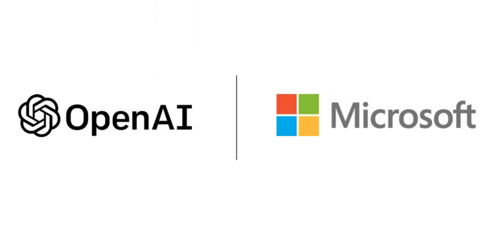
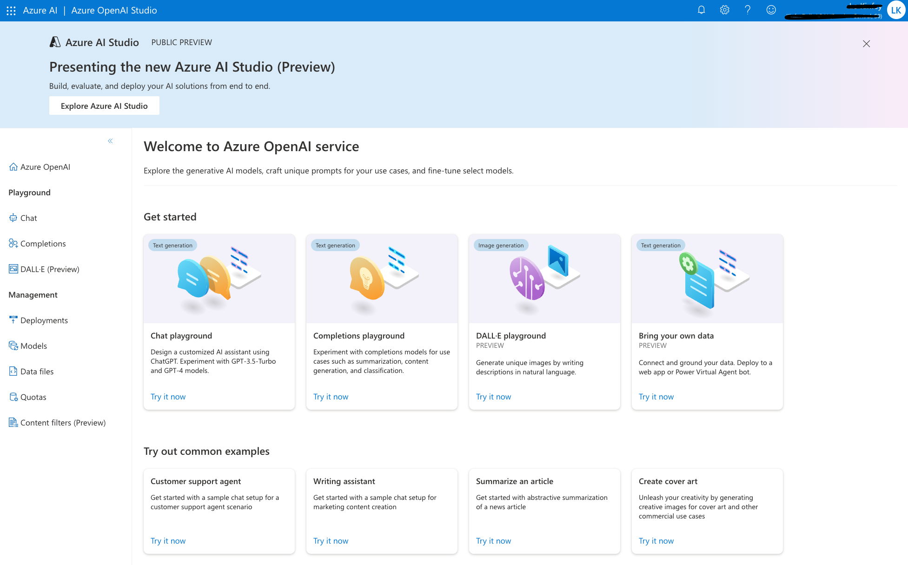
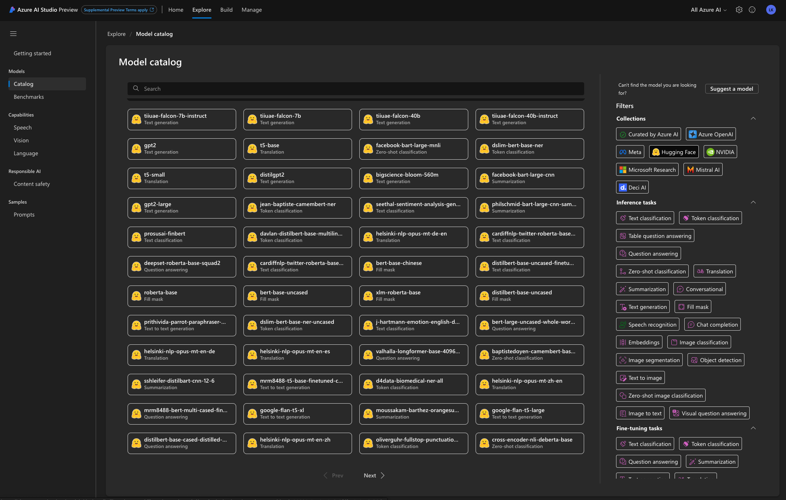

# **前言：了解大型语言模型**

从上世纪 50 年代开始，人类对人工智能就开始探索。人工智能给人的印象一直是一个划时代的技术，需要有专业技能的数据科学领域从业人员才能使用。但从 2022 年年底开始，人工智能的领域发生了重大改变。 OpenAI 发布 GPT-3 模型开始，人工智能不再是单一领域或者说单一场景的解决方案。全新的多模态大型语言模型模型改变了游戏规则，无论你从事什么样的工作，都可以用自然语言和大型语言模型模型进行交流，大型语言模型模型反馈给你的是生成式的内容，这就包括文本，图片，视频等，大大增强了可用性。在进入 Semantic Kernel 的内容前，希望在前言部分和大家说说与大型语言模型模型相关的故事，让各位可以更好地理解大型语言模型模型。

## **大型语言模型基础**

大型语言模型模型（英文：Large Language Model，缩写LLM），也称大型语言模型，是一种人工智能模型，旨在理解和生成人类语言。它们在大量的文本数据上进行训练，可以执行广泛的任务，包括文本总结、翻译、情感分析等等。大型语言模型模型的特点是规模庞大，包含数十亿的参数，帮助它们学习语言数据中的复杂模式。这些模型通常基于深度学习架构以及 Transformer 算法。大型语言模型模型的训练方式是通过自我监督学习，即通过预测序列中的下一个词或标记，为输入的数据生成自己的标签，并给出之前的词。训练过程包括两个主要步骤：预训练和微调。在预训练阶段，模型从一个巨大的、多样化的数据集中学习，通常包含来自不同来源的数十亿词汇，如网站、书籍和文章。在微调阶段，模型在与目标任务或领域相关的更具体、更小的数据集上进一步训练，这有助于模型微调其理解，并适应任务的特殊要求。现在很多公司都在开发大型语言模型，为世人所熟知的就包括 OpenAI 的 GPT-X 和 DALLE-X 系列，以及 Meta 的 LLama, Google 的 Gemini ，以及百度的问心一言等。OpenAI 中的 GPT-4 是现阶段最好的大型语言模型，有非常大的优势。但随着时间推移，也有不少好的行业垂直领域模型诞生。

### **Transformer 算法**

Transformer 算法是一种基于自注意力机制的深度学习模型，它可以用于处理自然语言和其他序列数据。它由编码器和解码器两部分组成，每部分包含多个层，每层又包含多头自注意力和前馈神经网络。Transformer 算法的优点是可以并行处理整个序列，捕捉长距离的依赖关系，而不需要使用循环神经网络或卷积神经网络。Transformer 算法最初是在论文《Attention Is All You Need》1中提出的，用于机器翻译任务。后来，它被广泛应用于其他自然语言处理任务，如文本摘要、问答、语音识别等。一些著名的基于 Transformer 的模型有 BERT、GPT-3 / 4、T5 等。

本次课程主要围绕 Azure OpenAI Services 的 OpenAI 3/3.5/4 以及 DALLE-3 展开。至于其他的模型会在日后更多的进阶内容上提及，大家可以关注我的 GitHub Repo .

## **OpenAI 以及相关模型介绍**

虽然 Transformer 的算法来自 Google ，但真正让大型语言模型进入公众视野的是 OpenAI. OpenAI 是一个人工智能研究和部署的公司，它的使命是确保人工通用智能（AGI）能够造福全人类。它的愿景是创造一个能够与人类合作和竞争的 AGI，同时遵循人类的价值观和道德。OpenAI 最初是一个非营利性的组织，由一些科技界的知名人士，如埃隆·马斯克、彼得·蒂尔、杨致远等创立于 2015 年1。它的目标是推进数字智能的发展，使其能够最大程度地惠及人类，而不受金钱利益的束缚。它的研究是开放和透明的，任何人都可以访问和使用 OpenAI 在人工智能领域有着开创性的研究，尤其是在生成模型和安全性方面。它开发了一些强大的大语言模型，如 GPT-3/3.5/4、ChatGPT、DALL·E、Whisper 等，它们可以理解和生成文本、图像、声音等多种形式的数据。它也致力于探索 AGI 的潜在风险和影响，以及如何使其与人类的目标和利益保持一致。

### **GPT 模型**

GPT（Generative Pre-trained Transformer，生成预训练变换器）是一种基于深度学习的自然语言处理（NLP）模型，由OpenAI开发。GPT系列模型以其能力强大和灵活性而闻名，在多种语言任务中表现出色。下面是GPT模型的一些关键特点和发展历程：

GPT的核心特点

1. 基于Transformer架构：GPT模型基于Transformer架构，这是一种特别适合处理序列数据（如文本）的深度学习模型。

2. 大规模预训练：GPT通过在大量文本数据上进行预训练来学习语言的通用模式和结构。这包括书籍、网页、新闻文章等各种来源的文本。

3. 微调应用：预训练后，GPT模型可以针对特定任务进行微调（fine-tuning），如问答、文本生成、翻译等。

4. 上下文敏感：GPT模型能够理解和生成与上下文相关的文本，这使得它在生成连贯和相关内容方面表现突出。

GPT 发展历程

GPT-1：第一个版本，展示了大规模未标记数据预训练的潜力，以及在多种任务上微调的有效性。

GPT-2：增大了模型规模和训练数据量，显著提高了文本生成的质量和准确性。GPT-2因其能够生成连贯且有时难以区分于人类编写的文本而引起广泛关注。

GPT-3：进一步扩大了模型规模，达到了前所未有的1750亿个参数。GPT-3在多项NLP任务上取得了革命性的表现，尤其是在可以少量或无需微调的情况下。

GPT-4及以后：随着技术的不断发展，后续的GPT模型可能会在模型规模、理解能力、多模态能力等方面继续进步。

GPT 应用领域
GPT 模型在众多领域都有广泛应用，包括但不限于：

文本生成：如文章撰写、创意写作、代码生成等。

聊天机器人：提供流畅的对话体验。

自然语言理解：如情感分析、文本分类等。

翻译和多语言任务：自动翻译不同语言。

知识提取和问答：从大量文本中提取信息，回答特定问题。

总的来说，GPT模型代表了当前人工智能和自然语言处理领域的一个重要里程碑，它的强大能力和多样的应用前景持续引领着技术发展的潮流。

#### **变革者 - GPT-3**

GPT-3 是一种大型语言模型，由 OpenAI 开发，可以理解和生成自然语言。它是目前最大的大型语言模型之一，拥有 1750 亿个参数，可以完成文本摘要、机器翻译、对话系统、代码生成等工作。GPT-3 的特点是可以通过简单的文本提示，即“少示例学习”（few-shot learning），来适应不同的任务和领域，而不需要额外的微调或标注数据。 GPT-3 打开了潘多拉魔盒，改变了行业规则。GPT-3 已经被应用于许多产品和服务中，如 OpenAI API、OpenAI Codex、早期的 GitHub Copilot 等，它们可以让开发者、创作者和学者更容易地使用和学习人工智能。GPT-3 也引发了一些关于人工智能的伦理、社会和安全的讨论和思考，如人工智能的偏见、可解释性、责任、影响等。

#### **进化 - GPT-3.5 和 ChatGPT**

GPT-3.5 和 ChatGPT 都是基于 GPT-3 架构的大语言模型，它们可以理解和生成自然语言。它们都有 1750 亿个参数，可以在多种语言处理任务上表现出惊人的能力，如文本摘要、机器翻译、对话系统、代码生成等。

GPT-3.5 和 ChatGPT 的主要区别在于它们的范围和目的。GPT-3.5 是一种通用语言模型，可以处理各种语言处理任务。另一方面，ChatGPT 是一个专用模型，专为聊天应用程序设计。它强调了与用户的互动和沟通，可以扮演不同的角色，如猫娘、明星、政治家等。它也可以根据用户的输入，生成图像、音乐、视频等多媒体内容。

GPT-3.5 和 ChatGPT 的另一个区别在于它们的训练数据和训练方式。GPT-3.5 是在 570 GB 的文本数据上进行了预训练，这些数据来自不同的来源，如网站、书籍、文章等。它的训练方式是通过自我监督学习，即通过预测序列中的下一个词或标记，为输入的数据生成自己的标签，并给出之前的词。ChatGPT 则是在 GPT-3.5 的基础上，使用了更多的对话数据，如社交媒体、聊天记录、电影剧本等，进行了进一步的微调。它的训练方式是通过多任务学习，即同时优化多个目标，如语言模型、对话生成、情感分类、图像生成等。

#### **绝对领导者 - GPT-4**

GPT-4（第四代生成预训练转换器）是由OpenAI开发的最新一代人工智能语言模型。它是GPT-3的继任者，拥有更先进和精细的功能。下面是 GPT-4 的一些主要特点：

更大的知识库和数据处理能力：GPT-4 可以处理更大量的数据，它的知识库比GPT-3更加广泛和深入。

更高的语言理解和生成能力：GPT-4 在理解和生成自然语言方面有显著提升，能更准确地理解复杂的语言结构和含义。

多模态能力：GPT-4 不仅可以处理文本，还可以理解和生成图像，提供多模态的交互体验。

更好的上下文理解：GPT-4 能更好地理解和维持长篇对话中的上下文，提供更连贯和一致的回答。

提高的安全性和可靠性：OpenAI在 GPT-4 中加强了对不当内容的过滤和控制，以提供更安全可靠的用户体验。

广泛的应用领域：GPT- 可应用于各种领域，包括但不限于聊天机器人、内容创作、教育辅助、语言翻译、数据分析等。

总的来说，GPT-4 在其前代模型的基础上做出了显著的改进和提升，能够提供更加强大和多样化的功能。 GPT-4 在现阶段有绝对的领导地位，也是很多公司大模型的追赶目标。

#### **进击！睁开眼睛看世界 - GPT-4V**

GPT-4V 全称是GPT-4 with Vision，它可以理解图片，为用户解析图片并回答图片相关的问题。 GPT-4V可以准确理解图像的内容，识别图像中物体、计算物体的数量、提供图片相关的洞察和信息、提取文本等。可以说 , GPT -4V 是大型语言模型的皇者，也让大型模型更好地理解世界。GPT-4V 的视觉主要能力和应用方向

**物体检测**：GPT-4V 能够识别并检测图像中的各种常见物体，例如汽车、动物和家居用品等。其识别能力已在标准图像数据集上进行了评估。

**文本识别**：此模型具备光学字符识别（OCR）技术，可在图像中发现打印或手写文字，并将其转换为机器可读的文本。这项功能在文档、标志和标题等图像中得到了验证。

**人脸识别**：GPT-4V 能够找出并识别图像中的人脸。它还具有一定程度的能力，可以通过面部特征来判断性别、年龄和种族属性。该模型的面部分析能力已在 FairFace 和 LFW 等数据集上进行了测试。

**验证码解决方案**：GPT-4V 在解决基于文本和图像的验证码时展示了视觉推理能力。这表明模型具有高级的解谜技巧。

**地理定位**：GPT-4V 能够识别风景图片中所呈现的城市或地理位置。这说明模型掌握了关于现实世界的知识，但也意味着存在泄露隐私的风险。

**复杂图像**：处理复杂的科学图表、医学扫描或具有多个重叠文本组件的图像时，该模型表现较差。它无法把握上下文细节。

### **DALL·E 模型**

DALL·E 是由 OpenAI 开发的一个先进的人工智能程序，专门用于生成图像。它是一个基于 GPT-3 架构的神经网络模型，但与 GPT-3 主要处理文本不同，DALL·E 的专长在于根据文本描述生成相应的图像。这个模型的名称是对著名艺术家萨尔瓦多·达利（Salvador Dalí）和流行动画角色沃利（WALL·E）的致敬。

DALL·E的关键特点
文本到图像的转换：DALL·E能根据用户提供的文本描述生成图像。这些描述可以非常具体或富有创造性，模型会尽力生成符合描述的图像。

创造性和灵活性：DALL·E在生成图像时展现出惊人的创造性，能够组合不同的概念和元素，创建出独特和创新的视觉作品。

多样性和细节：该模型能生成多种风格和类型的图像，并能处理复杂的、具有细节的描述。

应用潜力：DALL·E在艺术创作、广告、设计等多个领域都有广泛的应用潜力。

DALL·E  应用场景包括

艺术创作：艺术家和设计师可以使用DALL·E来探索新的创意和视觉表现。

广告和媒体：生成符合特定主题或概念的图像。

教育和娱乐：用于教学材料的制作或创造娱乐内容。

研究和探索：探索人工智能在视觉艺术领域的可能性。

DALL·E 的出现标志着人工智能在创造性任务中的一个重要进步，显示了 A I在视觉艺术领域的巨大潜力。 现在最新的 DALL·E 模型是 DALL·E 3 。

### **Whisper 模型**

Whisper 是由OpenAI开发的一种先进的自动语音识别（ASR）模型。这个模型专注于转录语音为文本，且在多种语言和不同的环境中都表现出了卓越的性能。以下是关于Whisper模型的一些关键特点：

特点
多语言支持：Whisper模型能够处理多种不同的语言和方言，使其在全球范围内具有广泛的适用性。

高精度识别：它能准确地识别和转录语音，即使在背景噪音较多的环境中也能保持较高的准确率。

自适应不同语境：Whisper不仅能识别标准的语音输入，还能适应各种口语化和非正式的对话风格。

易于集成和使用：作为一个机器学习模型，Whisper可以集成到各种应用和服务中，提供语音识别功能。

应用

自动字幕和转录：为视频和音频内容自动生成字幕或文本。

语音助手和聊天机器人：提高语音助手和聊天机器人对语音指令的识别能力。

无障碍服务：帮助有听力障碍的人士更好地理解音频内容。

会议和讲座记录：自动记录和转录会议或讲座的内容。

总体来说，Whisper模型代表了自动语音识别领域的一个重要进步，其多语言和高精度识别能力使其在各种应用场景中都极具价值。

## **微软 与 OpenAI**

微软和OpenAI之间的合作关系是当代人工智能领域的一个重要发展。自从OpenAI成立以来，微软就一直是其重要的合作伙伴和支持者。以下是他们合作的一些关键方面和影响：

**投资和合作**

资金支持：微软在OpenAI的早期就进行了重大投资，包括数亿美元的资金。这些投资帮助OpenAI发展其研究项目和技术。

云计算资源：微软向OpenAI提供了其Azure云计算平台的资源，这对于训练和运行大型AI模型，如GPT和DALL·E系列模型，至关重要。

**技术合作**

共同研发：两家公司在多个AI项目和技术上展开了合作，共同推动人工智能的发展。

产品集成：OpenAI的某些技术，如GPT-3，已被集成到微软的产品和服务中，例如Microsoft Azure和其它企业级解决方案。

**战略合作**

可持续和安全的AI：双方致力于发展既可持续又安全的AI技术，重视AI伦理和安全性问题。

拓展AI应用：通过合作，两家公司致力于将AI技术应用到更广泛的领域，例如健康保健、教育和环境保护等。

**影响**

加速AI技术的发展：这种合作促进了人工智能技术的快速发展和创新。

商业应用和服务：微软通过将OpenAI的技术应用于其产品和服务，推动了人工智能在商业领域的广泛应用。

推动AI民主化：这种合作有助于使更多的企业和开发者能够访问和使用先进的AI技术。

总体来说，微软与OpenAI之间的合作是技术创新和商业应用相结合的典范，这种合作对人工智能技术的发展和普及产生了深远的影响。随着双方合作的不断深化，可以预期他们将继续在人工智能领域发挥重要作用。

### **Azure OpenAI Service**

Azure OpenAI Service 是 Microsoft Azure 与领先的人工智能研究组织 OpenAI 之间的合作。 Azure OpenAI Service 是一个基于云的平台，使开发人员和数据科学家能够快速轻松地构建和部署人工智能模型。 借助 Azure OpenAI，用户可以访问各种 AI 工具和技术来创建智能应用程序，包括自然语言处理、计算机视觉和深度学习。Azure OpenAI Service 旨在加速 AI 应用程序的开发，使用户能够专注于创建为其组织和客户创造价值的创新解决方案。

Azure OpenAI Service 提供对 OpenAI 强大语言模型的 REST API 访问，这些模型包括 GPT-4、GPT-4 Turbo with Vision、GPT-3.5-Turbo 和嵌入模型系列。 此外，新的 GPT-4 和 GPT-3.5-Turbo 模型系列现已正式发布。 这些模型可以轻松适应特定的任务，包括但不限于内容生成、汇总、图像理解、语义搜索和自然语言到代码的转换。 用户可以通过 REST API、Python SDK 或 Azure OpenAI Studio 中基于 Web 的界面访问该服务。

使用 Azure OpenAI Service 你需要有 Azure 账号，然后通过该链接进行申请，等待 1-3 工作日即可使用 Azure OpenAI Service。

**Azure OpenAI Studio**

我们可以通过 Azure OpenAI Studio 管理我们的模型，以及在 Playground 中测试我们的模型

***注意：*** 所有例子都基于 Azure OpenAI Services

## **Hugging Face**

Hugging Face 是一家专注于自然语言处理（NLP）的人工智能研究公司，以其开源项目和在NLP领域的创新而闻名。公司成立于2016年，其总部位于纽约，但它在全球范围内有影响力和活动。

### **主要贡献和产品**

**Transformers库**：Hugging Face 最著名的贡献是其开发的 “Transformers” 库，这是一个广泛使用的Python库，包含了多种预训练的NLP模型，如BERT、GPT、T5等。这个库使得访问和使用这些复杂模型变得更加容易，对促进NLP领域的研究和应用有重大影响。

**模型共享和社区**：Hugging Face建立了一个强大的社区，促进了研究者和开发者之间的模型和知识共享。通过其平台，任何人都可以上传、分享和使用预训练模型。

**研究和合作**：Hugging Face在人工智能领域进行积极的研究，与学术界和工业界的众多团队合作。

**教育和资源**：Hugging Face还提供各种教育资源，包括教程、文档和研究论文，帮助人们更好地了解和使用NLP技术。

### **影响**

技术创新：Hugging Face在推动NLP领域的技术创新方面发挥了重要作用，特别是在预训练模型的发展和应用方面。

降低技术门槛：通过提供易于使用的工具和资源，Hugging Face 降低了在NLP领域工作的技术门槛，使得更多的研究者和开发者能够参与到这一领域中。

社区建设：其强大的社区和开源文化促进了知识共享和协作，加速了 NLP 技术的发展和创新。

虽然 Hugging Face 最初是作为一个面向消费者的聊天机器人应用开始的，但它迅速转变为专注于提供NLP技术和资源的公司。现在，它不仅支持研究和教育，还为企业提供商业解决方案，如定制模型训练、数据处理和机器学习咨询服务。

综上所述，Hugging Face 是NLP领域的一个关键参与者，其开源精神和对社区的贡献在促进人工智能技术的民主化和创新方面发挥了重要作用。 

Azure AI Studio 也支持 Hugging Face 模型引入，可以让企业更好地结合业务场景使用不同模型解决不同应用场景的问题。

## **小结**

本章为大家介绍了现阶段和大型语言模型相关的知识，特别在 OpenAI, Microsoft, Hugging face 主流大型语言模型平台的相关知识，以及不同模型的应用场景和性能。对于应用场景来说，我们不可能只使用一个模型。在 AI 2.0 时代，我们需要有不同模型的支持，完成更多的智能化应用场景。无论在云端和本地，大型语言模型的应用场景都是未来几年所关注的热点。作为初学者你需要做的是了解不同模型，结合实际场景来完成应用搭建。

