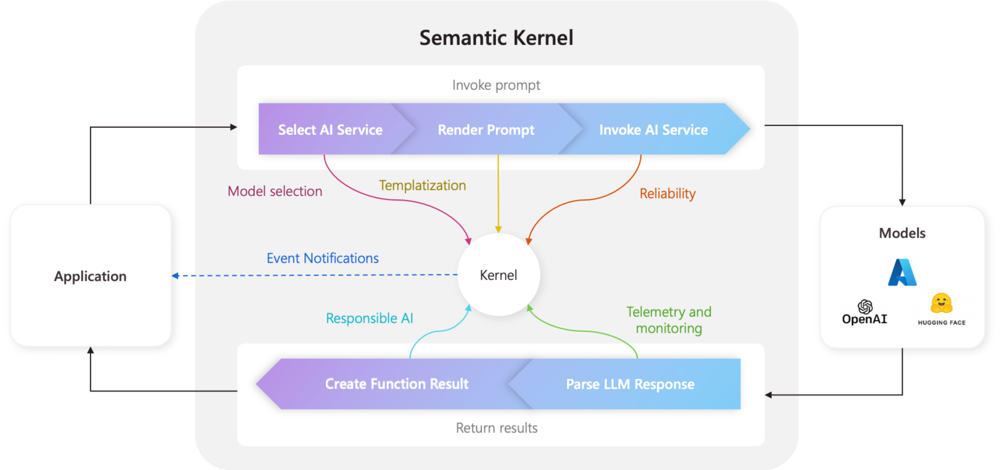

# **第二章：Semantic Kernel 基础**

我们已经和大家讲述了 LLMs 以及利用 .NET 和 Python SDK 链接 Azure OpenAI Service 的方法。接下来我们就将进入 Semantic Kernel 的世界。在 2023 年我们有非常多的基于 LLMs 的框架诞生，我们为什么要选择 Semantic Kernel ? Semantic Kernel 的优缺点是什么？还有作为传统开发者如何使用 Semantic Kernel ? 我都会在本章内容中和大家一一细说。

## **什么是 Semantic Kernel**

Semantic Kernel 是一个轻量级的开源框架，通过 Semantic Kernel 您可以快速使用不同编程语言(C#/Python/Java)结合 LLMs(OpenAI、Azure OpenAI、Hugging Face 等模型) 构建智能应用。在我们进入生成式人工智能后，人机对话的方式有了很大的改变，我们用自然语言就可以完成与机器的对话，门槛降低了非常多。结合提示工程和大型语言模型，我们可以用更低的成本完成不同的业务。但如何把提示工程以及大模型引入到工程上？我们就需要一个像 Semantic Kernel 的框架作为开启智能大门的基础。在 2023 年 5 月，微软 CTO Kevin Scott 就提出了 Copilot Stack 的概念，人工智能编排就是核心。 Semantic Kernel 具备和 LLMs 以及各种提示工程/软件组成的插件组合的能力，因此也被看作 Copilot Stack 的最佳实践。通过 Semantic Kernel，你可以非常方便地构建基于 Copilot Stack 的解决方案，而且对于传统工程，也可以无缝对接。

### **Semantic Kernel vs LangChain**

我们没法不去作出一些客观的比较，毕竟 LangChain 拥有更多的使用群体。无可否认在落地场景上，LangChain 现在比 Semantic Kernel 更多，特别在入门参考例子上。我们来个更为全面的比较：

***LangChain*** 基于 Python 和 Javascript的开源框架，包含了众多预制组件，开发者可以无需多写提示工程就可以完成智能应用的开发。特别在复杂的应用场景，开发人员可以快速整合多个预定义的组件来综合完成。在开发角度，更适合具备数据科学或则人工智能基础的开发人员。

***Semantic Kernel*** 您可以基于 C#, Python, Java 的开源框架。更大的优势在工程化。毕竟它更像一个编程范式，传统开发人员可以很快掌握该框架进行应用开发，而且可以更好结合自定义的插件和提示工程完成企业的定制化业务智能化工作。

两者有很多共通点，都还在版本迭代，我们需要基于团队结构，技术栈，应用场景作出选择。

### **Semantic Kernel 的特点**

1. **强大的插件** - 你可以通过结合自定义/预定义的插件解决智能业务的问题。让传统的代码和智能插件一起工作灵活地接入到应用场景，简化传统应用向智能化转型的过程。

2. **多模型支持** - 为您的智能应用配置“大脑”，可以是来自 Azure OpenAI Service , 也可以是 OpenAI ，以及来自 Hugging Face 上的各种离线模型。通过链接器你可以快速接入不同的“大脑”，让您的应用更智能更聪明。

3. **各式各样的链接器** - 链接器除了链接“大脑”外，还可以链接如向量数据库，各种商业软件，不同的业务中间件，让更多的业务场景进入智能成为可能

4. **开发便捷** - 简单易用，开发人员零成本入门

### **Semantic Kernel 的缺点**

毕竟 LLMs 还在不停发展，有很多新模型的加入，也有很多新的功能，以及新的概念引入。Semantic Kernel， LangChain 等开源框架都在努力适应这个新的摩尔定律，但版本的迭代会有不确定的更改。所以在使用的时候，开发者需要多留意对应 GitHub Repo 上的变更日志。

还有 Semantic Kernel 需要兼顾多个编程语言，所以进度也是不一致，也会导致 Semantic Kernel 在不同技术栈人群的选择。


### **Semantic Kernel 中的 Kernel**

如果把 Semantic Kernel 看作是 Copilot Stack 最佳实践，那 Kernel 就是 AI 编排的中心，在官方文档中也有所提及。通过 Kernel 可以和不同插件，服务，日志以及不同的模型链接在一起。所有 Semantic Kernel 的应用都从 Kernel 开始。




## **用 Semantic Kernel 构建一个简单的翻译项目**

说了一些基础知识，我们开始学习，如何把 Semantic Kernel 引入到 .NET 和 Python 工程项目。我们用四步完成一个翻译的实现

### **第一步：引入 Semantic Kernel 库**


**.NET 开发者**

***注意：我们在这里使用的是最新的 Semantic Kernel 1.3.0  的版本, 并使用 Polyglot Notebook 来完成相关学习***


```csharp

#r "nuget: Microsoft.SemanticKernel, *-*"

```


**Python 开发者**


***注意：我们在这里使用的是最新的 Semantic Kernel 0.5.1.dev  的版本, 并使用 Notebook 来完成相关学习***


```python

! pip install semantic-kernel -U

```


### **第二步：创建 Kernel 对象**


这里注意，我们需要把 Azure OpenAI Service 相关的 Endpoin，Key 以及 模型的 Deployment Name 都放在一个固定文件内，方便调用以及设置。在 .NET 环境我设置在 Settings.cs 环境，在 Python 环境我设置在 .env 环境中

**.NET 开发者**

```csharp

using Microsoft.SemanticKernel;
using Microsoft.SemanticKernel.Connectors.OpenAI;


Kernel kernel = Kernel.CreateBuilder()
            .AddAzureOpenAIChatCompletion(Settings.AOAIModel , Settings.AOAIEndpoint, Settings.AOAIKey)
            .Build();

```

**Python 开发者**

```python

import semantic_kernel as sk
import semantic_kernel.connectors.ai.open_ai as skaoai

kernel = sk.Kernel()
deployment, api_key, endpoint = sk.azure_openai_settings_from_dot_env()
kernel.add_chat_service("azure_chat_competion_service", skaoai.AzureChatCompletion(deployment,endpoint,api_key=api_key,api_version = "2023-12-01-preview"))


```
### **第三步：引入插件**

在 Semantic Kernel 中，我们有不同的插件，用户可以使用预定义的插件，也可以使用自定义的插件。想了解更多可以关注下一章的内容，我们会详细讲述插件的使用。该例子，我们使用的是自定义插件，已经在 plugins 目录下了。


**.NET 开发者**

```csharp

var plugin = kernel.CreatePluginFromPromptDirectory(Path.Combine(pluginDirectory, "TranslatePlugin"));


```


**Python 开发者**

```python

pluginFunc = kernel.import_semantic_plugin_from_directory(base_plugin,"TranslatePlugin")

```


### **第四步：执行**


**.NET 开发者**

```csharp

translateFunc = pluginFunc["Basic"]

result = await translateFunc("你好，我是你的 AI 编排助手 - Semantic Kernel")


```


**Python 开发者**

```python

translateFunc = pluginFunc["Basic"]

result = translateFunc("你好，我是你的 AI 编排助手 - Semantic Kernel")


```

具体实现，您可以访问


***.NET 例子*** 请[点击访问这里](https://github.com/microsoft/SemanticKernelCookBook/blob/main/notebooks/dotNET/02/LearnSK.ipynb)

***Python 例子*** 请[点击访问这里](https://github.com/microsoft/SemanticKernelCookBook/blob/main/notebooks/python/02/LearnSK.ipynb)


## **小结**

您第一次接触到 Semantic Kernel 的感觉如何呢？您在本章中学习到 Semantic Kernel 的基础知识，以及相关的知识。并了解到 Semantic Kernel 和 LangChain 的对比，以及相关优缺点，对您在工程落地的过程中会有所帮助。我们也通过 Semantic Kernel 四步完成了一个翻译，当是完成了一个大模型时代下的 hello world，给你的入门带来信心。接下来您可以打开下一章的进阶学习，了解更多的 Semantic Kernel 知识。


