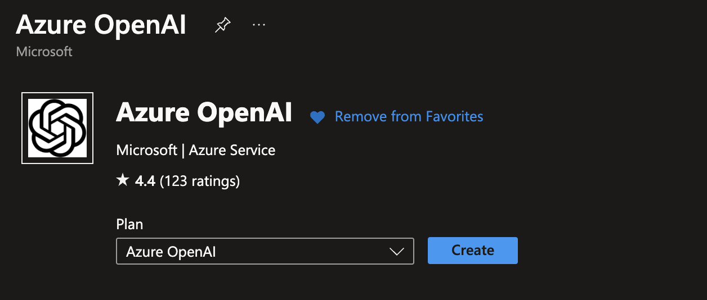
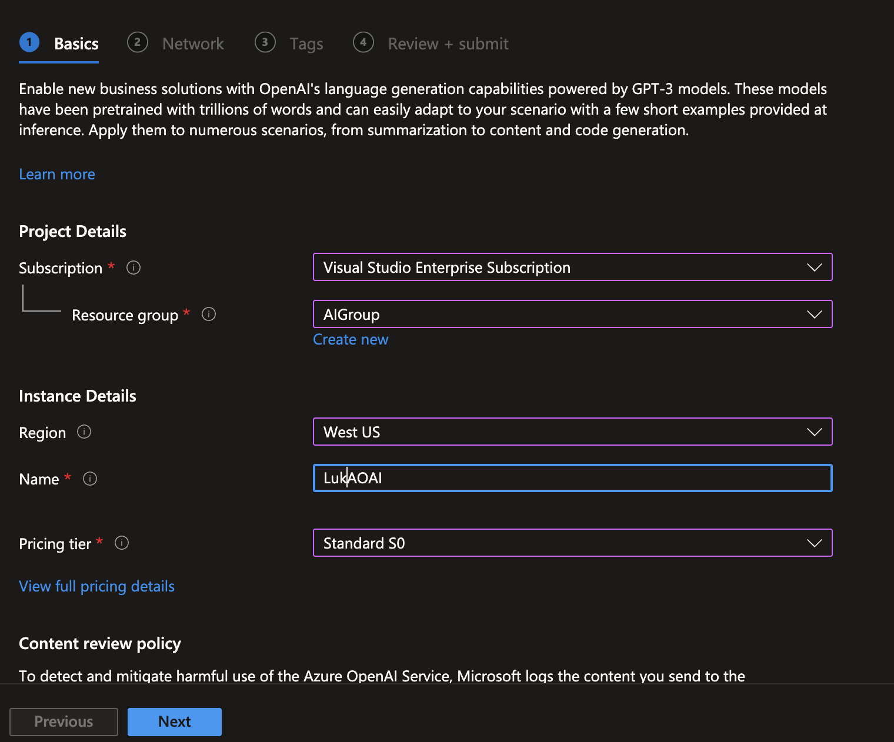
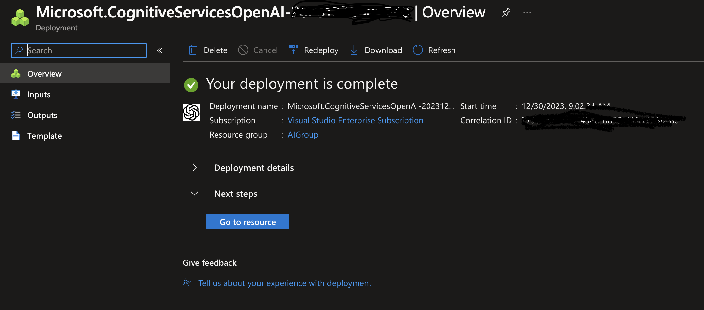
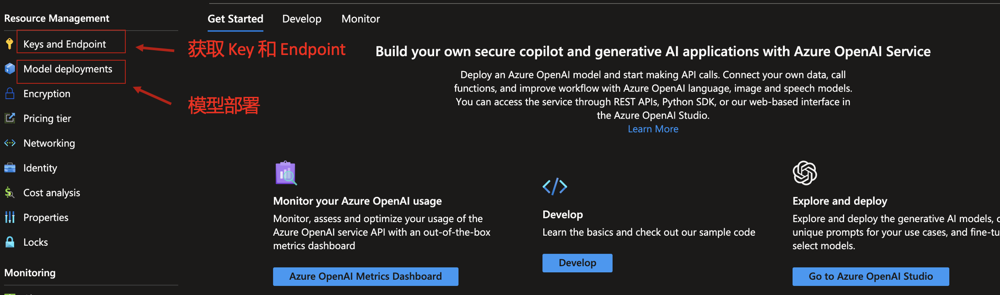
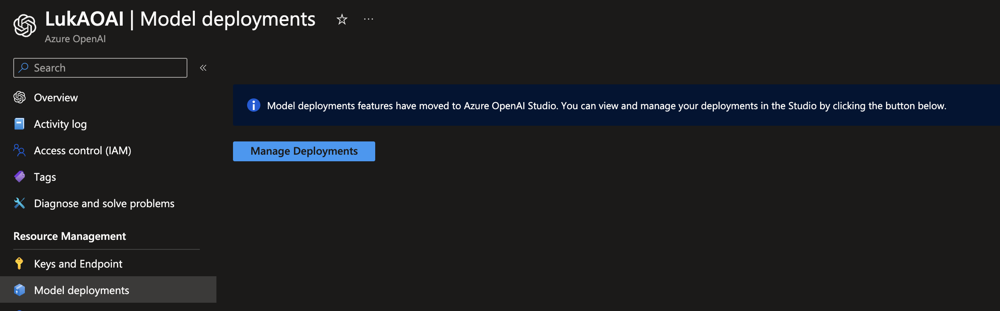
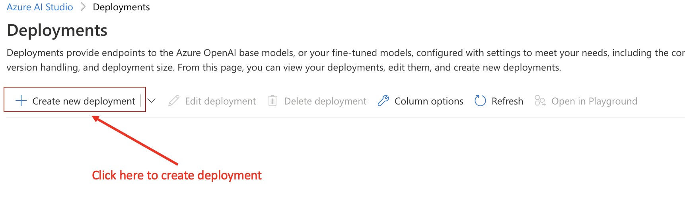
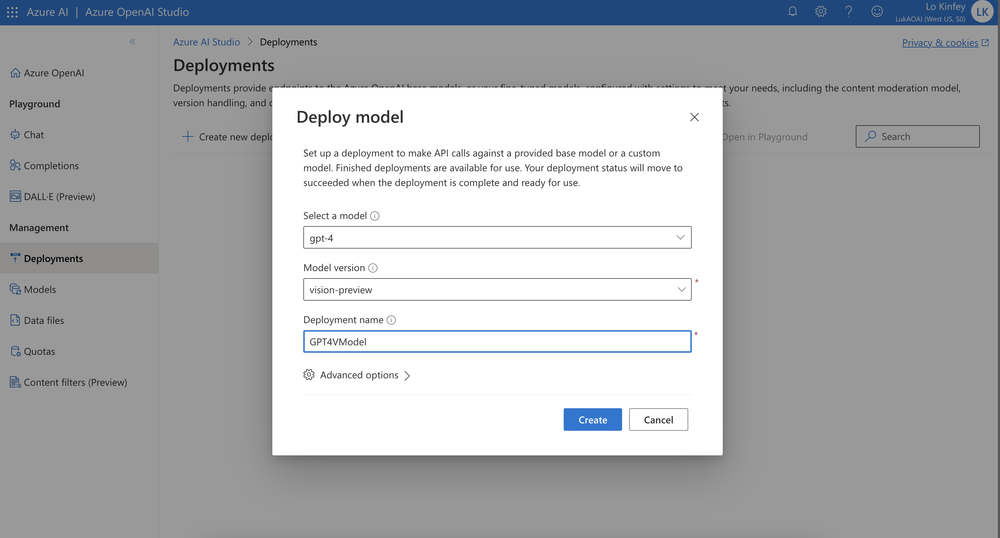
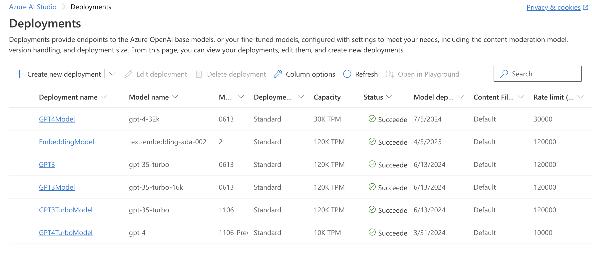

# **Using Azure OpenAI Service With SDK**

In the preface, we learned about LLMs. Now I want to talk about how to use LLMs. Before Learning Semantic Kernel, I would like you to see how to correctly accessAzure OpenAI Service through the SDK. 

## **Deploy the model in Azure OpenAI Studio**

Deploying an Azure OpenAI model is very easy. After successfully applying for Azure OpenAI Service, you can deploy it by creating resources in Azure Portal. Here are the steps:

1. Select Azure OpenAI to create resources in [Azure Portal](https://portal.azure.com/)



After click 'Create', configure the region where Azure OpenAI is located. Please note: Because the resource distribution is different, different regions have different OpenAI models. You must understand it clearly before using it.



Wait for a moment



2. Go to the created resources, you can deploy the model, and obtain the Key and Endpoint required when calling the SDK



3. Enter 'Model Deployment' and select 'Management Deployment' to enter Azure OpenAI Studio



4. Deploy your model in Azure OpenAI Studio



Choose the model you need



this is your model list




Congratulations, you have successfully deployed the model. Now you can use the SDK to connect it.


## **Using SDK with Azure OpenAI Service**

The SDK that interfaces with Azure OpenAI Service includes the SDK released by OpenAI for the Python version, and the SDK released by Microsoft for .NET. As a beginner, it is recommended to use it in a Notebook environment so that it is easier to understand the key steps of execution.


### **Python SDK**

The official Python SDK released by OpenAI supports linking OpenAI and Azure OpenAI Service. Now OpenAI SDK has released version 1.x, but many people on the market are using version 0.2x. ***The content of this course will be based on OpenAI SDK version 1.x and use Python 3.10.x. ***


```python

! pip install openai -U

```


### **.NET SDK**

Microsoft releases an SDK based on Azure OpenAI Service. You can get the latest package through Nuget to complete .NET generative AI applications. ***The content of this course will be based on .NET 8 and the latest Azure.AI.OpenAI SDK to demonstrate examples. Of course, Polyglot Notebook will also be used as the environment***


```csharp

#r "nuget: Azure.AI.OpenAI, *-*"

```

We have configured the SDK environment based on .NET / Python above. Next, we need to create the linked class to complete the related initialization work.

Getting started with the .NET environment


```csharp

string endpoint = "Your Azure OpenAI Service Endpoint";
string key = "Your Azure OpenAI Service Key";

OpenAIClient client = new(new Uri(endpoint), new AzureKeyCredential(key));

```

Getting started with the Python environment


```python

client = AzureOpenAI(
  azure_endpoint = 'Your Azure OpenAI Service Endpoint', 
  api_key='Your Azure OpenAI Service Key',  
  api_version="Your Azure OpenAI API version"
)

```


## **Using SDK to call Azure OpenAI Service API**

### ***1. Completion API***

This is based on the gpt-35-turbo-instruct model, which is a very important API for text completion.

**Completion API with .NET**

```csharp

CompletionsOptions completionsOptions = new()
{
    DeploymentName = "gpt-35-turbo-instruct", 
    Prompts = { "Can you introduce what is generative AI ?" },
};

Response<Completions> completionsResponse = client.GetCompletions(completionsOptions);

string completion = completionsResponse.Value.Choices[0].Text;

```

**Completion API with Python**


```python

start_phrase = 'Can you introduce what is generative AI ?'

response = openai.Completion.create(engine=deployment_name, prompt=start_phrase, max_tokens=1000)

text = response['choices'][0]['text'].replace('\n', '').replace(' .', '.').strip()

```

### ***2. Chat API***

This is an API based on the gpt-35-turbo and gpt-4 models for the chat scenario

**Chat with .NET**

```csharp

var chatCompletionsOptions = new ChatCompletionsOptions()
{
    DeploymentName = "gpt-4", 
    Messages =
    {
        new ChatRequestSystemMessage("You are my coding assistant."),
        new ChatRequestUserMessage("Can you tell me how to write python flask application?"),
    },
    MaxTokens = 10000
};

Response<ChatCompletions> response = client.GetChatCompletions(chatCompletionsOptions);

```

**Chat with Python**

```python

response = client.chat.completions.create(
    model="gpt-35-turbo", # model = "deployment_name".
    messages=[
        {"role": "system", "content": "You are my coding assistant."},
        {"role": "user", "content": "Can you tell me how to write python flask application?"}
    ]
)

print(response.choices[0].message.content)

```

### ***3. Generate images API***

Scenario of Generate images based on DallE 3 model

**Generate images with .NET**


```csharp

Response imageGenerations = await client.GetImageGenerationsAsync(
        new ImageGenerationOptions()
        {
            DeploymentName = "Your Azure OpenAI Service Dall-E 3 model Deployment Name",
            Prompt = "Chinese New Year picture for the Year of the Dragon",
            Size = ImageSize.Size1024x1024,
        });


```


**Generate images with Python**


```python

result = client.images.generate(
    model="dalle3", 
    prompt="Chinese New Year picture for the Year of the Dragon",
    n=1
)

json_response = json.loads(result.model_dump_json())

```


### ***4. Embeddings API***

Based on text-embedding-ada-002 model, implementation based on vector conversion


**Embeddings with .NET**


```csharp

EmbeddingsOptions embeddingOptions = new()
{
    DeploymentName = "text-embedding-ada-002",
    Input = { "Kinfey is Microsoft Cloud Advocate" },
};

var returnValue = openAIClient.GetEmbeddings(embeddingOptions);

foreach (float item in returnValue.Value.Data[0].Embedding.ToArray())
{
    Console.WriteLine(item);
}

```


**Embeddings with Python**

```python

client.embeddings.create(input = ['Kinfey is Microsoft Cloud Advocate'], model='text-embedding-ada-002 model').data[0].embedding

```


## **Samples**

Examples related to the above APIs are listed below. Please click here

### ***Python examples*** Please visit [Click here](https://github.com/microsoft/SemanticKernelCookBook/blob/main/notebooks/python/01/PythonSDKAOAIDemo.ipynb)

### ***.NET examples*** Please visit [Click here](https://github.com/microsoft/SemanticKernelCookBook/blob/main/notebooks/dotNET/01/dotNETSDKAOAIDemo.ipynb)

## **Summary**

We use the most original and basic SDK to deal with Azure OpenAI Service. This is also our first step towards generative AU programming. We can understand different interfaces more quickly without using a framework, and it also lays the foundation for us to enter Semantic Kernel


